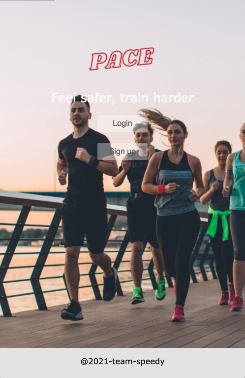
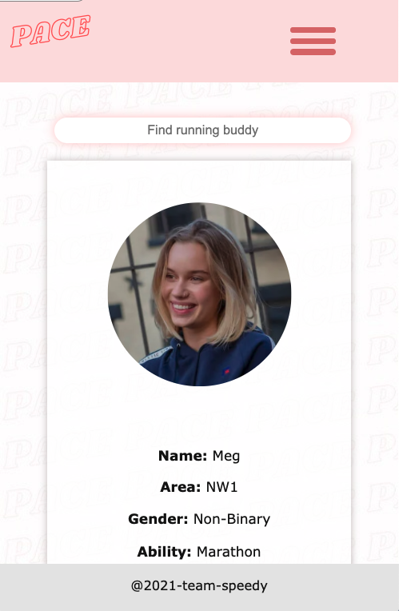
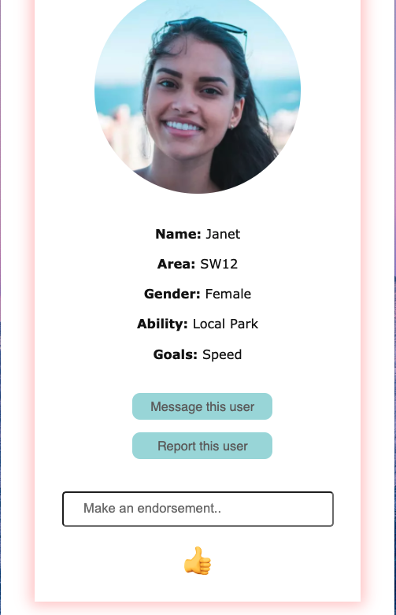
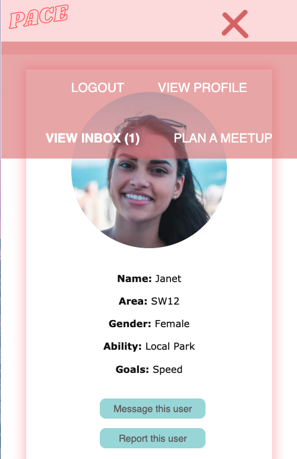
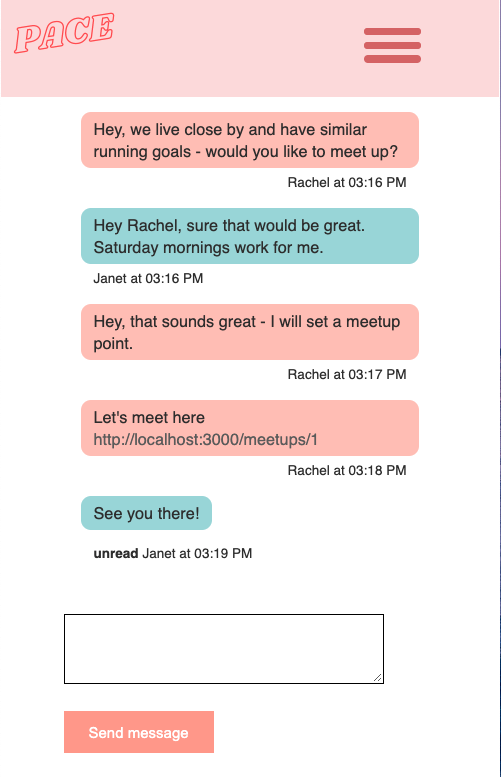

# Pace

A running app built in Rails, designed to help runners feel safer and train harder.

Originally inspired by the idea of bringing people together via their common interests, namely exercise, we stretched the idea further to address the social issue of women's safety when running. The app is inclusive of all people, but offers a medium through which people can meet up safely and securely. Where they can find a partner to hold them accountable to their fitness goals and provide them with safety along the way. 

## Getting started

* After cloning into this repository run `bundle install` to install required gems
* Then run these commands to set up the databases:
`rails db:create`
`rails db:migrate`
* To check tests passing run `rspec`
* Finally, to view the site, run `rails server`

## Screenshots

  
Landing

  
Home page

  
User profile

  
Navbar

  
Messaging

  
Maps

## Features

* User sign up/log in/log out
* User can input key pieces of fitness information about themselves into their profile
* Users can search for other users based on these criteria
* Users can visit the profiles of other users
* Users can message other users on their profiles
* Users can see messages delivered to them in their inbox
* All conversations are stored in their inbox
* Users can set a meetup point on a map where they can meet up with their partner
* They can share the location in the chat
* They can view the meetup spot marked on a map
* Users can endorse other users 
* Users can report other users

## Built using
* Ruby on Rails
* Ruby
* HTML
* CSS
* JavaScript
* PostgreSQL
* Google Maps API
